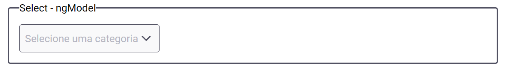

<p align="center">
  
  <br>
  Teste Técnico - Desenvolvedor Front-End (Angular)
</p>

<p align="center">
  
  
</p>

## 📝 Índice

- [Sobre](#-sobre)
- [Iniciando](#-iniciando)
- [Testes](#-testes)
- [Build](#-build)
- [Componentes](#-componentes)
  - [`app-select`](#app-select)
  - [`app-switch`](#app-switch)
- [Issues e Pull Requests](#%EF%B8%8F-issues-e-pull-requests)
- [CI/CD (Azure DevOps)](#-cicd-azure-devops)
- [Autores](#-autores)

## 📖 Sobre

- 🏷️ A versão do NodeJS utilizada foi a 20.11.0
- 🖥️ Este projeto foi gerado utilizando o [Angular CLI](https://github.com/angular/angular-cli) versão 19.1.4.
- 🔍 As orientações do teste estão disponíveis no arquivo [TODO.md](./TODO.md), contendo também os links para o handoff.

## 🏃 Iniciando

> [!NOTE]
> [Executar no StackBlitz](https://stackblitz.com/github/iamtheluiz/totvs-angular-tech-test) • Este projeto pode ser executado no StackBlitz, uma IDE online para desenvolvimento web.

Para executar localmente, clone este repositório e acesse a pasta criada:

```bash
# Cloning repository
git clone https://github.com/iamtheluiz/totvs-angular-tech-test.git

cd totvs-angular-tech-test/
```

Instale todas as dependências do NodeJS:

```bash
npm install
```

Por fim, inicie o servidor de desenvolvimento:

```bash
npm run start
```

## 📝 Testes

Para executar os testes unitários, execute o comando:

```bash
npm run test
```

Também existe uma opção para executar os testes em um processo de esteiras (pipeline):

```bash
npm run test:ci
```

> [!NOTE]
> O comando "test:ci" gera um relatório de cobertura de testes em XML, que pode ser acessado em `coverage/report/cobertura-coverage.xml`, e um relatório dos casos de teste em `tests/results/junit.xml`.

## 🔨 Build

Para compilar o projeto, execute:

```bash
npm run build
```

Isso irá compilar o projeto e armazenar os artefatos de build no diretório `dist/`. Por padrão, o build de produção otimiza sua aplicação para desempenho e velocidade.

## 📦 Componentes

Foram criados dois componentes para este projeto:

### `app-select`

Componente de seleção de opções, que recebe um array de objetos e exibe as opções em um dropdown.



#### Entradas

- `name: string` - Nome do campo
- `placeholder: string` - Texto exibido quando nenhuma opção está selecionada
- `disabled: boolean` - Define se o campo está desabilitado
- `error: boolean` - Define se o campo está com erro
- `options: Array<SelectOption>` - Array de objetos com as opções a serem exibidas
- `label: string` - Label do campo (utilizado para acessibilidade)

#### Uso

```html
<app-select
  name="select"
  placeholder="Selecione uma opção"
  [disabled]="false"
  [error]="false"
  [options]="[
    { value: '1', label: 'Opção 1' },
    { value: '2', label: 'Opção 2' },
    { value: '3', label: 'Opção 3' }
  ]"
  label="Selecione uma opção"
/>
```

### `app-switch`

Componente de switch, que exibe um botão de alternância.


#### Entradas

- `checked: boolean` - Define se o switch está ativo.
- `disabled: boolean` - Define se o switch está desabilitado.
- `label: string` - Label do campo (utilizado para acessibilidade).

#### Saídas

- `checkedChange: EventEmitter<boolean>` - Evento emitido quando o switch é ativado ou desativado.

#### Uso

```html
<app-switch
  [checked]="false"
  [disabled]="false"
  label="Ativar switch"
  (checkedChange)="onSwitchChange($event)"
/>
```

## 🛠️ Issues e Pull Requests

Durante o desenvolvimento deste projeto, foram criadas as seguintes issues e pull requests para gerenciar as tarefas e melhorias:

### Issues
- **[#1 - Feat: Select Component](https://github.com/iamtheluiz/totvs-angular-tech-test/issues/1)**
- **[#2 - Feat: Switch Component](https://github.com/iamtheluiz/totvs-angular-tech-test/issues/2)**
- **[#5 - Feat: Pipeline with a Pull Request Trigger](https://github.com/iamtheluiz/totvs-angular-tech-test/issues/5)**

### Pull Requests
- **[PR #3 - Feat/select component](https://github.com/iamtheluiz/totvs-angular-tech-test/pull/3)**: Implementa o componente "select".
- **[PR #4 - Feat/switch component](https://github.com/iamtheluiz/totvs-angular-tech-test/pull/4)**: Implementa o componente "switch".
- **[PR #6 - Feat/components review](https://github.com/iamtheluiz/totvs-angular-tech-test/pull/6)**: Revisa os componentes "select" e "switch", implementando requisitos de acessibilidade.
- **[PR #7 - Feat/components sample](https://github.com/iamtheluiz/totvs-angular-tech-test/pull/7)**: Adiciona paginação para a aplicação, considerando as páginas "home" e "samples".

> [!NOTE]
> As issues e PRs foram utilizadas para organizar o processo, permitindo um melhor acompanhamento do progresso e das mudanças realizadas.

## 🚀 CI/CD (Azure DevOps)

Este projeto possui um pipeline de CI/CD configurado no Azure DevOps, que executa os testes unitários e cobertura.
- [totvs-angular-tech-test-CI](https://dev.azure.com/luiz-vasconcellos/TOTVS%20-%20Angular%20Test/_build?definitionId=1)

> [!NOTE]
> Sua execução é acionada ao detectar alterações nas branches `main` e `develop`, e ao criar um pull request para elas.

## 💼 Autores

- **Luiz Gustavo da Silva Vasconcellos** - [iamtheluiz](https://github.com/iamtheluiz)
  - LinkedIn: [Luiz Gustavo da Silva Vasconcellos](https://www.linkedin.com/in/luiz-gustavo-da-silva-vasconcellos)
